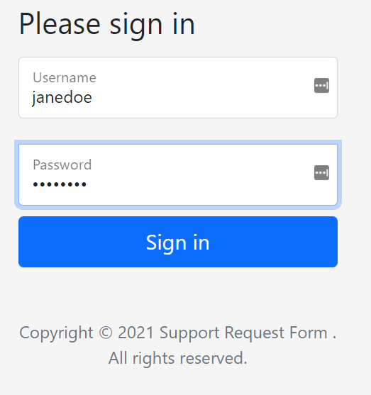
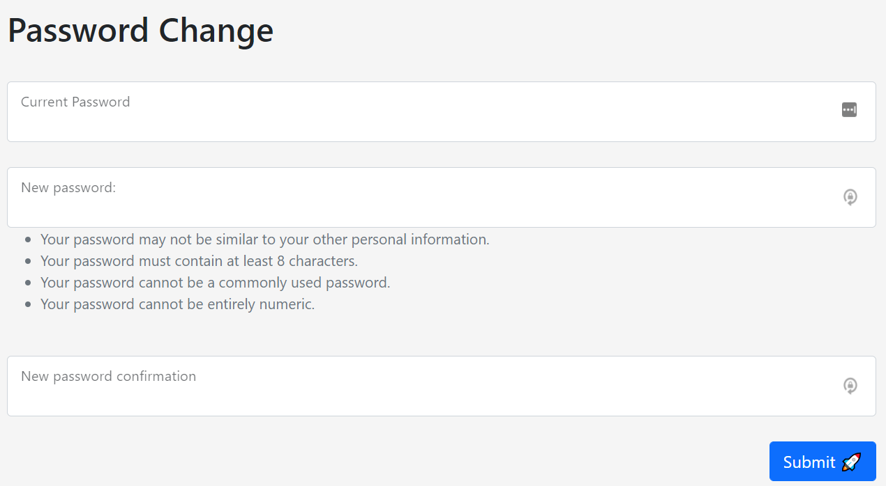
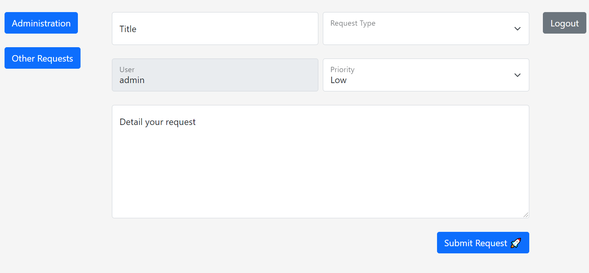

# Simple support requests form
Simple request form for support requests using Django.
Create support requests, register them to GitLab and send notifications to Teams/Slack.

Staff Users and non-staff users are required to change the initial password

### Get started:

1. Create a python3 virtual env
    - you may need to install `python3.8-venv` (or 3.x deppending on your python version):

        ```bash
        sudo apt install python3.8-venv
        ```

    - Create a python virtual env using the this command:

        ```bash
        python3 -m venv py-env
        ```

2. Activate the virtual env:

    ```bash
    source py-env/bin/activate
    ```

3. Upgrade pip to the latest version before installing requirements:

    ```bash
    pip3 install --upgrade pip
    ```

4. Clone the repo using ssh.
5. Enter the `django_project` folder and install the requirements using :
    
    ```bash
    cd django_project
    pip install -r requirements.txt
    ```
6. Apply the database migrations:

    ```bash
    python manage.py makemigrations
    python manage.py migrate
    ```
7. Use the `env_template` to create a valid `.env`:
    
    ```bash
    cp env_template .env
    ```
8.  Create a super user in Django, follow the dialogs to set up the user name and password:

    ```bash
    python manage.py createsuperuser
    ```
    You can also ran the `create-certificate.sh` script to create a super user. The password is defined in the `.env` file by the `ADMIN_PASS` variable.

9. Run the application locally using the Django Web Server; you can access it using the following url `http://<ip>:<port>/admin`, using the user and password defined in the previous step:

    ```bash
    python manage.py runserver 0.0.0.0:8001
    # 0.0.0.0:8001 means all IPs (0.0.0.0) on port 8001
    ```
    Use `ifconfig` to find the <b>VM</b> / <b>WSL</b> IP address and use it to access the application on port `8001`.

10. Optional: Production mode - running in `https` mode using gunicorn with self-signed certificates:

    ⚠️If there are NO certificates in `django_project` folder, use the bellow command to create new certificates:

        ```bash
        openssl req -newkey rsa:4096 \
                -x509 \
                -sha256 \
                -days 3650 \
                -nodes \
                -out django_proj.crt \
                -keyout django_proj.key
        ```

    Run Django in production/https mode:
    
    ```bash
    gunicorn django_project.wsgi:application \
        --certfile=django_proj.crt  \
        --keyfile=django_proj.key \
        --capture-output \
        --bind 0.0.0.0:8443
    ```

    or, if use want to use the daemon + log files:

        
    ```bash
    gunicorn django_project.wsgi:application \
        --certfile=django_proj.crt  \
        --keyfile=django_proj.key \
        --capture-output \
        --access-logfile access.log \
        --error-logfile error.log \
        --capture-output \
        --bind 0.0.0.0:8443 \
        --daemon
    ```

    Notes: Production mode doesn't provide the the Django Static files
    
___

## Some system's screenshots
----
1. Login Screen

    

2. Password Change Screen

    

3. Request form Screen

    